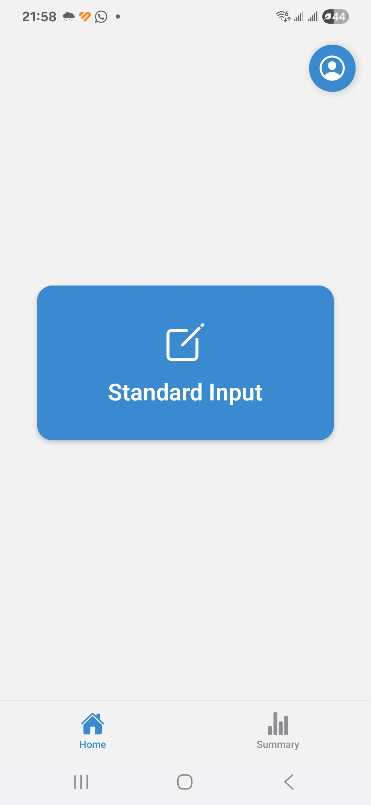
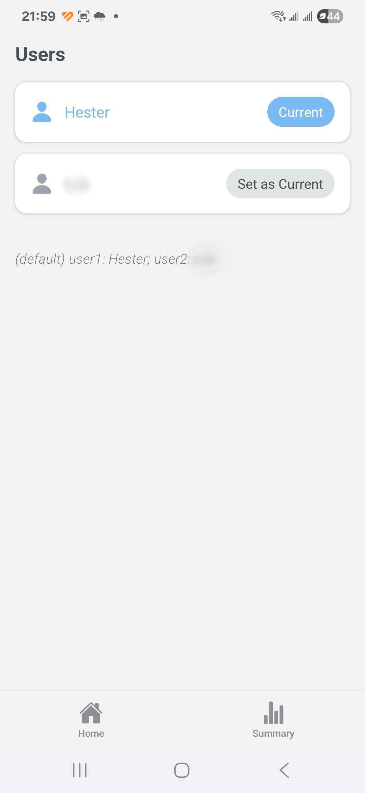
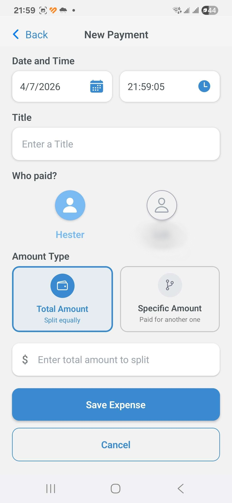
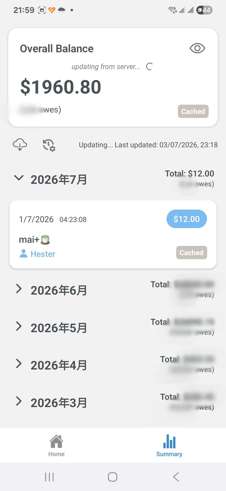

# Shared Expense Splitter

A cross-platform mobile application built with React Native for managing shared expenses between two users.

## Overview

Shared Expense Splitter simplifies expense sharing by allowing two users to record expenses, automatically split costs, and keep balances synchronized across devices.

This project was developed as our personal product and is actively used in daily life.

## Features

- Record shared expenses
- Automatic 50/50 expense splitting
- Custom payment allocation
- Running balance calculation
- Monthly expense summary
- Offline caching
- Cloud synchronization
- User switching

## Tech Stack

- React Native
- TypeScript
- Expo
- Firebase Firestore
- AsyncStorage

## Screenshots

  
  

  
  

## Future Improvements

- Expense categories
- Charts and analytics
- Receipt attachment
- Export transaction history
- Multi-user support

## Status

🚧 Actively maintained.